# Answers

## Software as a Service - Back-End Development

### Diploma of Information Technology (Advanced Programming)

### Diploma of Information Technology (Back-End Development)

| Given Name | Family Name | Student ID |
| ---------- | ----------- | ---------- |
| Darren     | Twomey      | 20123545   |

# Declaration

I, THE ABOVE NAMED student, by submitting this assessment, I am acknowledging the following:

- The submission is completely my own work.
- I have not used AI in the formuation of the answers within this assessment.
- I have acknowledged all sources of information used in this work (if required).
- I have kept a copy of this assessment (where practicable).
- I understand a copy of my assessment will be kept by TAFE for their records.
- I understand my assessment may be selected for use in the TAFEs validation and audit process to ensure student assessment meets requirements.

When submitting this assessment, I am accepting the above acknowledgement.

---

```table-of-contents
title: # Contents
style: nestedList
minLevel: 0
maxLevel: 3
includeLinks: true
```

---

# How to Answer Questions

Each time you answer a question, fill out the space provided for the answer to the question.

## Answer Requiring an Explanation

Answers to questions should be completed as "block quotes", replacing the `ANSWER_HERE` with the answer, and preceding each line with a greater than sign `>`. To add a new paragraph ensure you leave a `>` with no text after it.

Example:

```markdown
    ## Question Z - How many sofwarte developers does it take to change a lightbulb?

    > None.
    > It is a hardware problem.
```

## Answer Requiring Code

When answering a question that requires code to be included, use a "code block", which starts with three back-ticks (/`) plus the language for the code (e.g. php, js, cpp, python, shell, text, et al).

Example:

````markdown
## Question X - Title

Query Solution:

```js
db.collection_name.find();
```
````

````

> Note:
>
> The NoSQL code used to answer the question is contained in a code block,wich opens with three back-ticks (\`\`\`) followed by js, contains the code on the lines below, and ends with three back-ticks (\`\`\`) at the start of the next line after the code. An example is shown above.
>
> It is important that code blocks start at the beginning of the line for formatting on GitHub, Obsidian or your preferred IDE render the code correctly.

## Answer Requiring Image(s) to Be Inserted

Images are to be saved in a folder called "`assets`" and are embedded into the Markdown document.

Images for this assessment MUST be named in the form `step-X-Ya.ext` where:

- `X` is the step number (e.g. for step 5 the number is `5`)
- `Y` is the question dot number (e.g. for question `2.3` the dot number is `3` )
- `a` is an optional letter to allow for multiple images for an answer.
- `ext` is the filename extension (e.g. `png`, `jpg`, `jpeg`, `svg`, et al)

To insert an image use the following syntax:

```markdown

````

For example, the markdown code:

```markdown
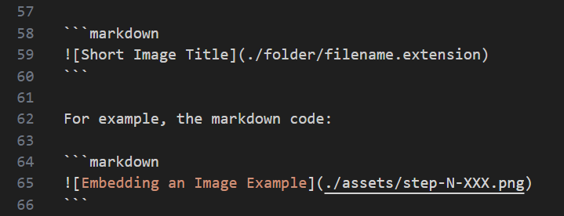
```

Gives:


---

# Step 1: Setting Up for Assessment

This step provides a checklist for yout to ensure you have set up the assessment requirements as needed.

## Checklist

Put an X between each of the pairs of `[ ]` when you have completed the task:

> - [x] Create a new **empty** & **private** repository on GitHub (or the equivalent).
> - [x] Repository is named `xxx-ICT50220-SaaS-2-BED-NoSQL` replacing `xxx` with your initials.
> - [x] Cloned the repository to your local PC.
> - [x] Created a new folder called `assets` inside your cloned repository.
> - [x] Created an empty `ReadMe.md`.
> - [x] Created an empty `.gitignore` file in the assets folder.
> - [x] Downloaded the provided `sample.gitignore` file, moved it into the repository folder, and renamed it to `.gitignore`.
> - [x] Placed a copy of the assessment's Word document into the repository folder.
> - [x] Added all the new files and folders to the repository, commited them to version control, and pushed them to your private remote repository.

---

# Step 2: NoSQL Systems

This step verifies you understand concepts that includes, but is not limited to such as databases, collections, fields, documents and naming conventions.

## 2.1 Naming Databases, Collections and Fields

What naming convention will you use for the database, collections and fields used in the assessment scenario?

> Snake case.

Why did you choose this naming convention?

> Hyphens can't be used, so lowercase and underscores (also known as snake case) is the preferred naming format.

## 2.2 Identify Data Types

Using the sample data provided, identify the field types and suitable names for the data storage in a MongoDB database.

In the `notes` column, add any clarifying details that may be useful.

Replace `FIELD_NAME_HERE` and `DATA_TYPE_HERE` in the table below.

> | Item               | Field Name   | Data Type | Notes                                     |
> | ------------------ | ------------ | --------- | ----------------------------------------- |
> | ID                 | \_id         | ObjectId  |                                           |
> | Title              | title        | String    |                                           |
> | Year               | year         | Int32     | four digit year                           |
> | Writer             | writers      | String    | ideally array, but string to match import |
> | Franchise          | franchise    | String    |                                           |
> | Running Time       | running_time | Int32     |                                           |
> | Budget             | budget       | Int32     |                                           |
> | Box Office Takings | box_office   | Int32     |                                           |
> | Actors             | actors       | String    | ideally array, but string to match import |
> | Directors          | directors    | String    | ideally array, but string to match import |
> | Summary            | summary      | String    |                                           |
> | Random             | random       | Double    |                                           |

## 2.3 Defining Terms

Briefly explain what is meant by the terms database, collection, document and field in terms of MongoDB.

> In MongoDB, a **database** is the container for one or more sets of related information, often grouped for the purposes of a single project.
>
> A **collection** is what would be a table in a RBMS, a group of objects that are all of the same type of object, but each with slightly different attributes.
>
> A **document** is what would be a row in a RDMS, an individual member of the collection with its own set of attributes.
>
> A **field** is what would be a cell in a RDMS, a unit of data representing a single attribute of the document.

## 2.4 NoSQL Database Types

Briefly outline the key features and advantages for TWO of the following NoSQL database types:

- Document Database
- Key-Value Store
- Wide-Column Oriented Database
- Graph Database

> ### Database Type 1: Document Database
>
> Key Features:
>
> - They offer flexible schemas where each document can have its own structure
> - They allow for hierarchical data which is great for nested data structures
> - The data can be queried using powerful query languages
>
> Advantages:
>
> Each document can have a different structure which makes it very flexible for storing complex data where each record has a varying amount of different information.

> ### Database Type 2: Key-Value Store
>
> Key Features:
>
> - They are simple and fast, making them great for quick lookups
> - They are very scalable allowing for easy distribution across multiple servers
> - They have no fixed schema which makes them flexible enough to store any type of data
>
> Advantages:
>
> In a Key-Value Database, each piece of data is stored as a key-value pair. Having a single search key means they can be very fast for read and write operations and are particular useful as lookup tables.

## 2.5 NoSQL Database Systems

Provide one example product (commercial or open source) for each of your NoSQL Database types.

You may **NOT** include _MongoDB_ which is an example of a _Document Database_.

> ### Database Type 1: Document Database
>
> CouchDB

> ### Database Type 2: Key-Value Store
>
> Redis

## 2.6 NoSQL Database Uses

Provide an example for each of your NoSQL database of the situation when your database types may provide a benefit when used.

The situations/application of the database types must be different.

> ### Database Type 1: Document Database
>
> When storing a patient's medical records, each record might have significantly different content. One might contain X-Ray results, while another contains blood work. The flexible schema of a document database allows each document to have whatever records it needs without impacting other records.

> ### Database Type 2: Key-Value Store
>
> Running a search query against the sum of human knowledge that is the internet can be a computationally expensive process. If a query and its results are stored as a key-value pair, then future duplicate queries can quickly make use of the stored (cached) information.

# Step 3: NoSQL Databases & Collections

## 3.1 Connecting

- Connect to a running instance of MongoDB (preferred to be your MongoDB Atlas instance).

Add the Connection String used to connect to your MongoDB Atlas instance:

> ```js
> mongosh "mongodb+srv://my-first-cluster.cclm2zu.mongodb.net/" --apiVersion 1 --username darren2me_db_user
> ```

### 3.2 Database Creation

- Create and use a database named `saas_bed_portfolio_2025s2`.

> ```js
> use saas_bed_portfolio_2025s2
> ```

Did you encounter any issues when creating the database? If you did, how did you resolve them?

> No

### 3.3 Collection Creation

- Create a new collection named _movies_ and insert the provided data (full statement)

Query Solution:

> ```js
> db.movies.insertOne({
>   title: "Star Trek: Nemesis",
>   year: 2002,
>   writers: "John Logan, Rick Berman, Brent Spiner",
>   summary:
>     "A clone of Picard, created by the Romulans, assassinates the Romulan Senate, assumes absolute power, and lures Picard and the Enterprise to Romulus under the false pretext of a peace overture.",
>   franchise: "Star Trek",
>   running_time: 117,
>   budget: 60000000,
>   box_office: 67300000,
> });
> ```

Screen Shot:

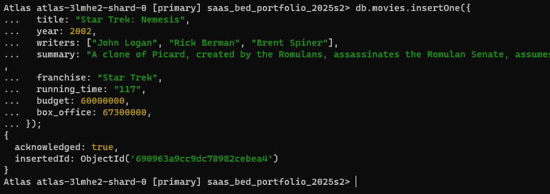

# Step 4: CRUD - Create

## 4.1 Inserting Data

- Add the supplied sample data into the movies collection using a **SINGLE** MongoDB Shell COMMAND in the order provided.

Query Solution:

> ```js
> db.movies.insertMany([
>   {
>     title: "Avatar",
>     writers: "James Cameron",
>     year: 2009,
>     running_time: 162,
>     budget: 237000000,
>   },
>   {
>     title: "Fictionally Fake Film",
>   },
>   {
>     title: "Little Shop of Horrors",
>     writers: "Howard Ashman, Charles B. Griffith",
>     year: 1986,
>     budget: 54000000,
>   },
>   {
>     title: "You Cannae be Serious About a Fictional Film",
>   },
> ]);
> ```

Screen Shot:

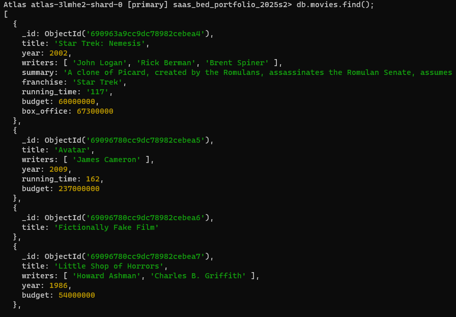

## 4.2 Inserting Data

Download the `movie_data.tsv` (Tab separated) or `movie_data.csv` (Comma separated) file from blackboard.

Using the `mongoimport` CLI command, import the data from one of the files to your collection.

What was the complete command you used to perform the import of the provided sample data?

> ```bash
> mongoimport --uri 'mongodb+srv://my-first-cluster.cclm2zu.mongodb.net/saas_bed_portfolio_2025s2' \
>    --username='darren2me_db_user' \
>    --collection='movies' \
>    --ignoreBlanks \
>    --type=csv \
>    --headerline \
>    --file=C:/Users/20123545/Desktop/film-data-csv.csv
> ```

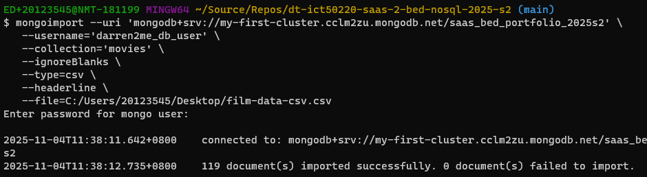

> Followed by a series of mongosh commands to clean the data:
>
> ```js
> db.movies.updateMany({}, { $rename: { "running time": "running_time" } });
> db.movies.updateMany({}, { $rename: { "box office": "box_office" } });
> db.movies.updateMany({}, { $rename: { writer: "writers" } });
> ```

## 4.3 Inserting Data

Add the provided additional sample data into the movies collection in the order provided.

You do not have to add any details to the answers.md for this question.

# Step 5: CRUD - Retrieve Queries

## 5.1 Retrieve all documents

- Get all documents from the movies collection.

Query Solution:

> ```js
> db.movies.find();
> ```

Screen Shot:


## 5.2 Retrieve all films written by…

- Get all documents with `writer` set to "`James Cameron`"

Query Solution:

> ```js
> db.movies.find({ writers: "James Cameron" });
> ```

Screen Shot:

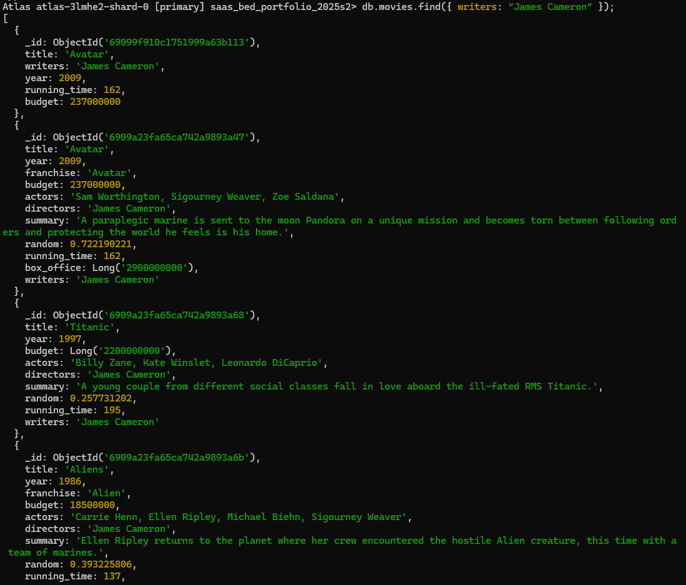

## 5.3 Retrieve films with actor(s)…

- Get all documents where `actors` include "`Kate Winslet`"

Query Solution:

> ```js
> db.movies.find({ actors: /Kate Winslet/ });
> ```

Screen Shot:

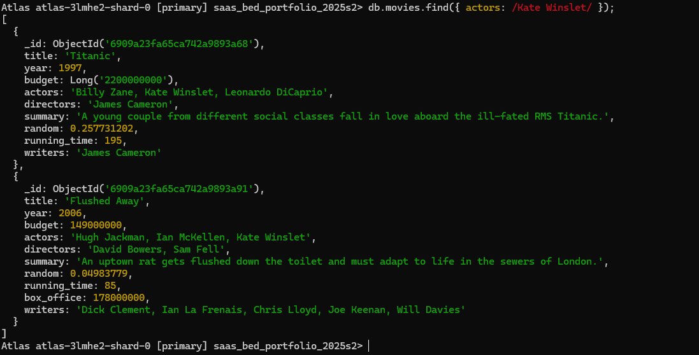

## 5.4 Retrieve films from a franchise…

- Get all documents with `franchise` set to "`The Hobbit`"

Query Solution:

> ```js
> db.movies.find({ franchise: "The Hobbit" });
> ```

Screen Shot:

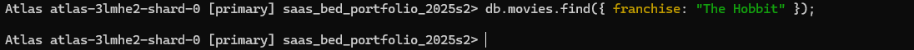

## 5.5 Retrieve films before/after…

- Get all movies released before `1970` or after `2020`

Query Solution:

> ```js
> db.movies.find({ $or: [{ year: { $lt: 1970 } }, { year: { $gt: 2020 } }] });
> ```

Screen Shot:

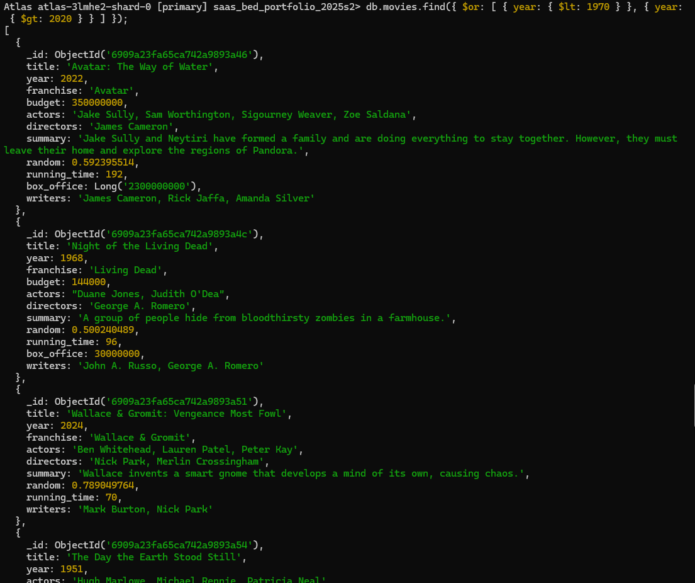

## 5.6 Retrieve films longer than…

- Get all movies with a running time of over `120` minutes

Query Solution:

> ```js
> db.movies.find({ running_time: { $gt: 120 } });
> ```

Screen Shot:

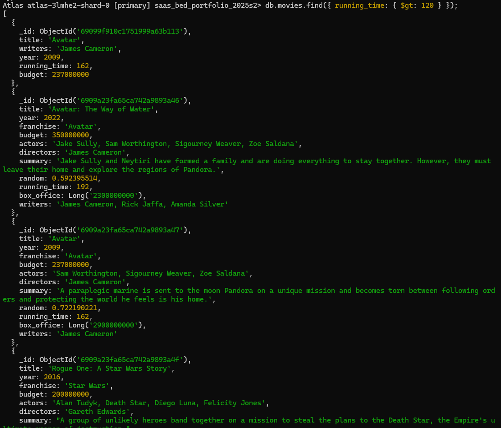

> # Step 6: Preface
>
> At this point, we were instructed to update the collection with two new documents posted in a Teams chat. Those documents had the actors, directors and writers fields as arrays. In order to maintain data consistency, and to adhere to what appears to be the actual intention of those fields, I decided to apply an aggregation to the collection to convert those fields to arrays for all documents that had them.
>
> ```js
> db.movies.aggregate([
>   {
>     $addFields: {
>       actors: { $split: ["$actors", ", "] },
>     },
>   },
>   {
>     $addFields: {
>       directors: { $split: ["$directors", ", "] },
>     },
>   },
>   {
>     $addFields: {
>       writers: { $split: ["$writers", ", "] },
>     },
>   },
>   { $out: "movies" },
> ]);
> db.movies.updateMany({ actors: null }, { $unset: { actors: "" } });
> db.movies.updateMany({ directors: null }, { $unset: { directors: "" } });
> db.movies.updateMany({ writers: null }, { $unset: { writers: "" } });
> ```
>
> Adapted from: Goldenbaum, S. (2019, November 14). _How to convert a comma separated string field to array in mongodb_. Stack Overflow. https://stackoverflow.com/questions/58848210/how-to-convert-a-comma-separated-string-field-to-array-in-mongodb

# Step 6: CRUD - Updates

## 6.1 Update document with a synopsis

- Using one or more queries, add the provided synopses to the indicated movies.

Query Solution:

> ```js
> db.movies.updateOne(
>   { title: "The Hobbit: The Desolation of Smaug" },
>   {
>     $set: {
>       summary:
>         "The dwarves, along with Bilbo Baggins and Gandalf the Grey, continue their quest to reclaim Erebor, their homeland, from Smaug. Bilbo Baggins is in possession of a mysterious and magical ring.",
>     },
>   }
> );
> db.movies.updateOne(
>   { title: "The Hobbit: An Unexpected Journey" },
>   {
>     $set: {
>       summary:
>         "A reluctant hobbit, Bilbo Baggins, sets out to the Lonely Mountain with a spirited group of dwarves to reclaim their mountain home - and the gold within it - from the dragon Smaug.",
>     },
>   }
> );
> ```

Screen Shot:


## 6.2 Update document with an actor

- Add the provided actors to the required films using one or more queries in the order provided...

Query Solution:

> **Note 1:** A query was run to create missing film documents, and so $set was used to add their initial actors. Subsequent updates used $push, except as mentioned in Note 2.
>
> ```js
> db.movies.insertMany([{ title: "Pulp Fiction" }, { title: "Star Trek VI: The Undiscovered Country" }]);
> ```

> **Note 2:** Section 3.3 had us create a document for "Star Trek: Nemesis" with no actors. The file imported in 4.2 had a "Star Trek: Nemesis" with 4 actors. Rather than push the actors and risk getting duplicates in the imported document, we have chosen to use $set along with updateMany(). The bigger issue is that we have a duplicate film, but I have decided that that is beyond the scope of this question.

> ```js
> db.movies.updateOne({ title: "Pulp Fiction" }, { $set: { actors: "Samuel L. Jackson" } });
> db.movies.updateOne(
>   { title: "Star Trek VI: The Undiscovered Country" },
>   { $set: { actors: ["William Shatner", "Leonard Nimoy", "DeForest Kelley", "James Doohan", "Christopher Plummer"] } }
> );
> db.movies.updateMany(
>   { title: "Star Trek: Nemesis" },
>   {
>     $set: {
>       actors: [
>         "Patrick Stewart",
>         "Jonathan Frakes",
>         "Brent Spiner",
>         "LeVar Burton",
>         "Michael Dorn",
>         "Gates McFadden",
>         "Marina Sirtis",
>       ],
>     },
>   }
> );
> db.movies.updateOne(
>   { title: "Star Trek VI: The Undiscovered Country" },
>   {
>     $push: {
>       actors: { $each: ["Walter Koenig", "Nichelle Nichols", "George Takei", "Kim Cattrall", "David Warner"] },
>     },
>   }
> );
> ```

Screen Shot:

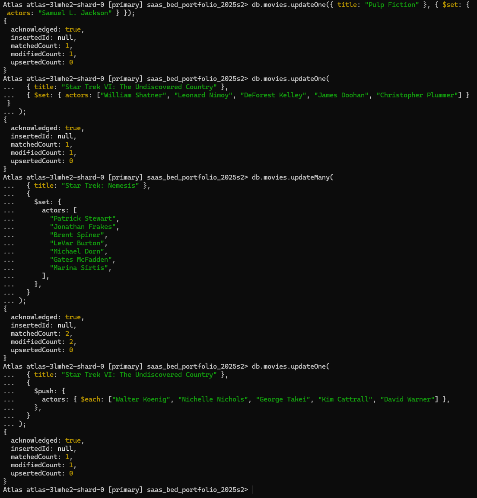
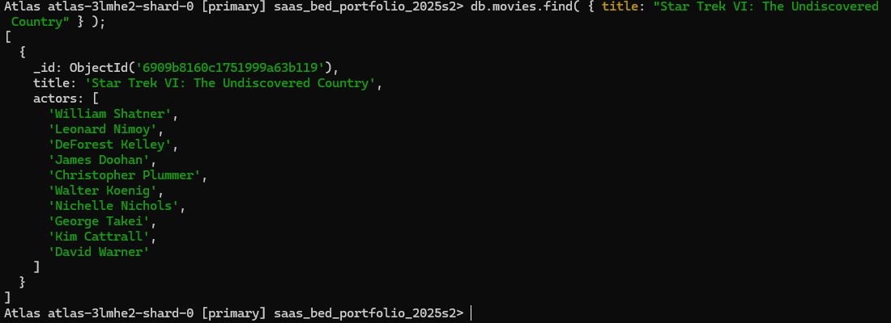

# Step 7: CRUD – Searches

Performing searches on collections.

## 7.1 Searching for titles with …

- Find all movies with the `title` starting with "`L`".

Query Solution:

> ```js
> db.movies.find({ title: /^L/ });
> ```

Screen Shot:

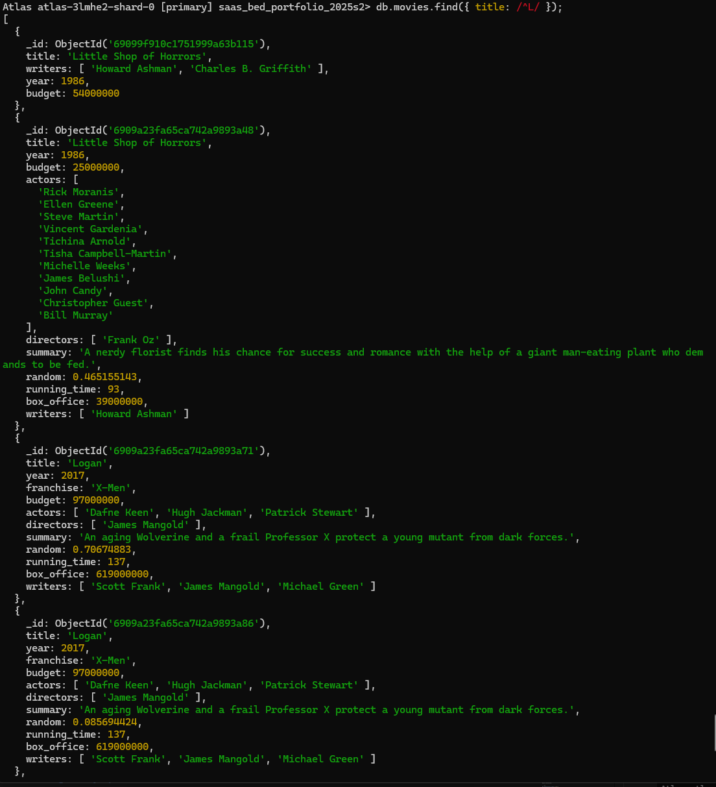

## 7.2 Searching for summaries with …

- Find all movies that have a `summary` that contains the word "`space`"

Query Solution:

> ```js
> db.movies.find({ summary: /space/ });
> ```

Screen Shot:

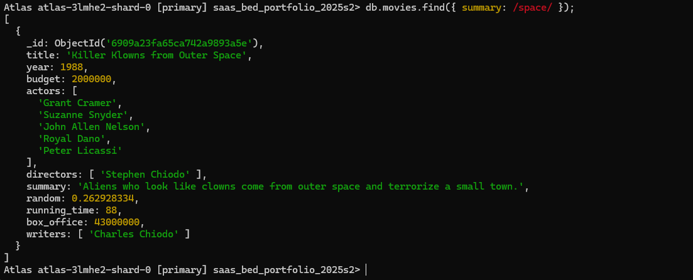

## 7.3 Searching for summaries with… and not …

- Find all movies that have a `summary` that contains the word "`Captain`" and not the word "`Pike`"

Query Solution:

> ```js
> db.movies.find({ summary: { $regex: /Captain/, $not: /Pike/ } });
> ```

Screen Shot:

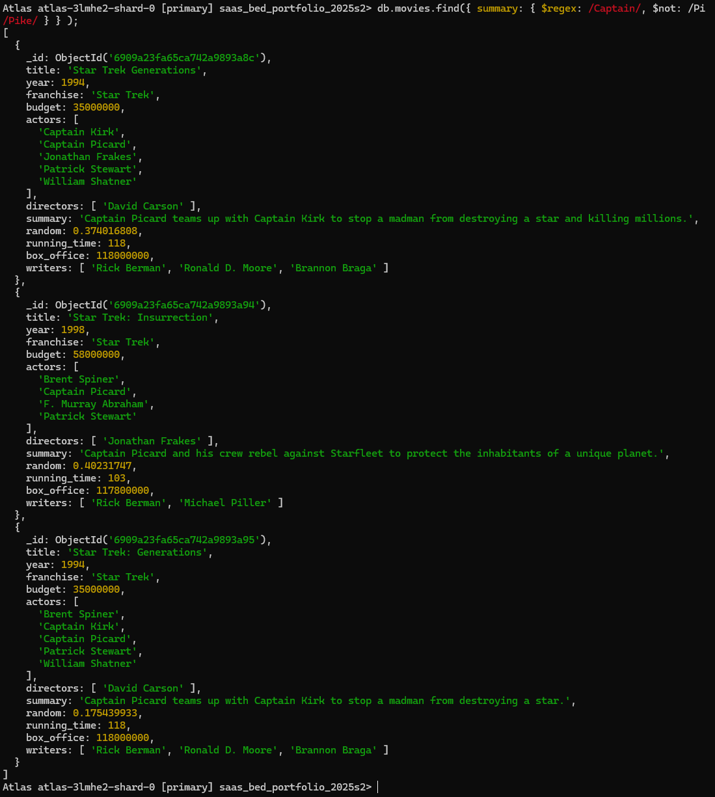

## 7.4 Searching for summaries with … or …

- Find all movies that have a `summary` that contains the word "`London`" or "`Brooklyn`"

Query Solution:

> ```js
> db.movies.find({ $or: [{ summary: /London/ }, { summary: /Brooklyn/ }] });
> ```

Screen Shot:

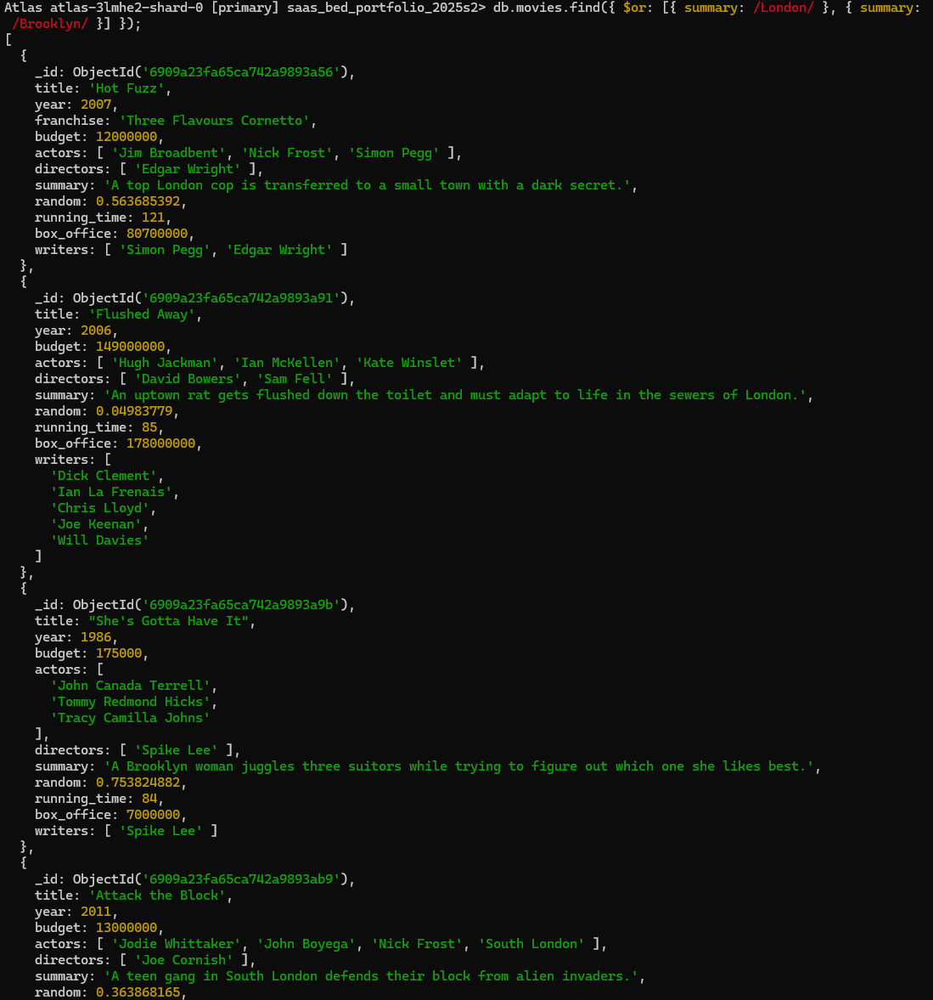

## 7.5 Searching for summaries with … and …

- Find all movies that have a summary that contains the words "`team`" and "`search`"

Query Solution:

> ```js
> db.movies.find({ $and: [{ summary: /team/ }, { summary: /search/ }] });
> ```

Screen Shot:

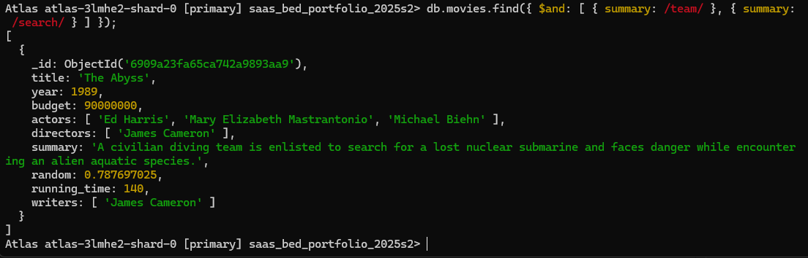

# Step 8: CRUD - Deletions

This step requires you to remove movies from the collection.

## 8.1 Removing a movie using its title…

- Delete the movie "`Pee Wee Herman's Big Adventure`"

Query Solution:

> ```js
> db.movies.deleteOne({ title: "Pee Wee Herman's Big Adventure" });
> ```

Screen Shot:

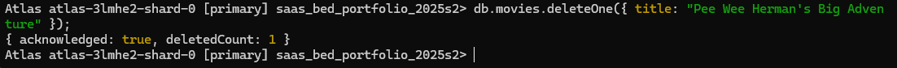

## 8.2 Remove a movie by ID…

Delete the movie “`Fictionally Fake Film`” by:

- Writing a query to discover the movie ID
- Then using the found ID to remove the movie

Query Solution:

> ```js
> db.movies.findOne({ title: "Fictionally Fake Film" });
> db.movies.deleteOne({ _id: ObjectId("6909d8eb0c1751999a63b11f") });
> ```

Screen Shot:

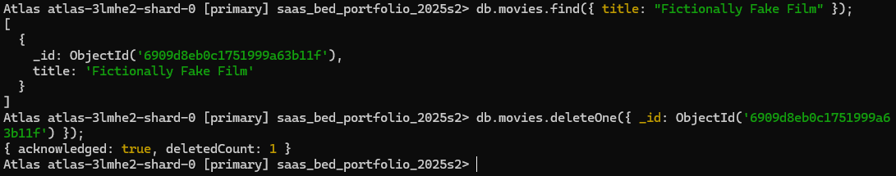

## 8.3 Removing multiple movies…

- Delete any movies with “`Fictional`” in their title

Query Solution:

> ```js
> db.movies.deleteMany({ title: { $regex: /\bFictional\b/i } });
> ```

Screen Shot:

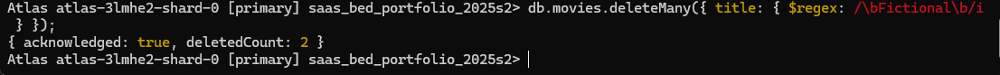

# Step 9: NoSQL Indexes

Using the movies collection, create the indexes to match the following conditions

## 9.1 Indexes for Sorting

- Create an index on the `title` field.

Query Solution:

> ```js
> db.movies.createIndex({ title: 1 });
> ```

- Create an index on the `year` and `title ` fields.

Query Solution:

> ```js
> db.movies.createIndex({ year: 1, title: 1 });
> ```

- Create an index on the `franchise`, `title`, `actors`, `year` fields.
- The index must be in the order year, title, actors then franchise.

Query Solution:

> ```js
> db.movies.createIndex({ year: 1, title: 1, actors: 1, franchise: 1 });
> ```

## 9.2 Indexes for Full Text Search

- Create a text index on the `title ` and `actors` fields.

Query Solution:

> ```js
> db.movies.createIndex({ title: "text", actors: "text" });
> ```

## 9.3 Verifying Execution Plans

- Check the execution plan for a query that finds the movies with a title containing “Star”. Check if the created index is being used.

Query Solution:

> ```js
> db.movies.explain().find({ $text: { $search: "Star" } });
> ```

Screen Shot:

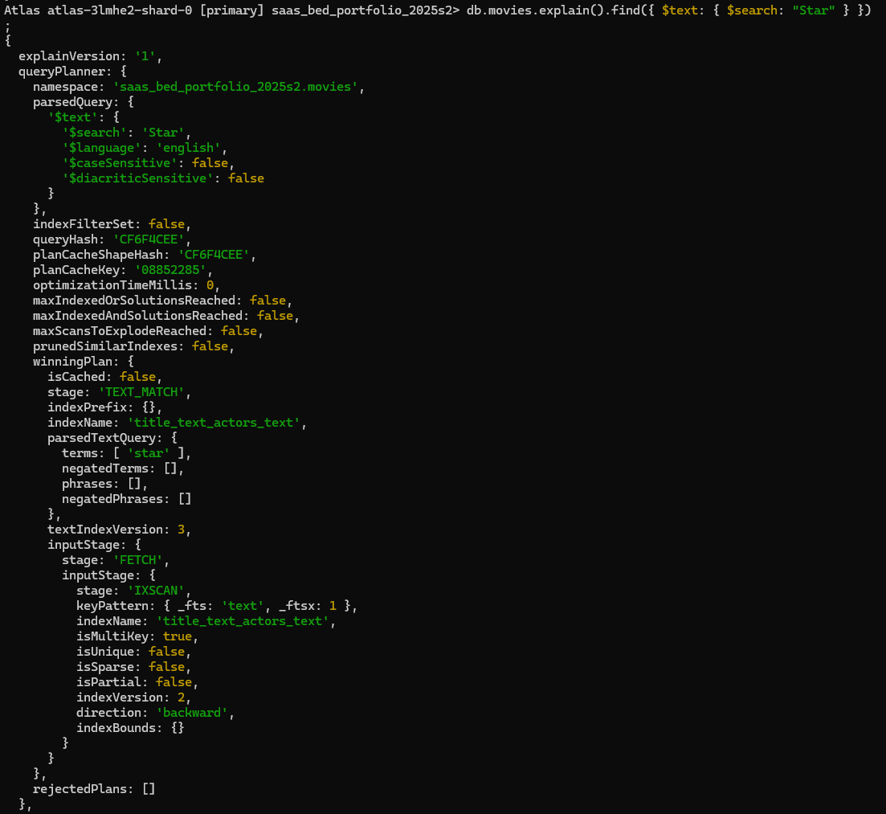
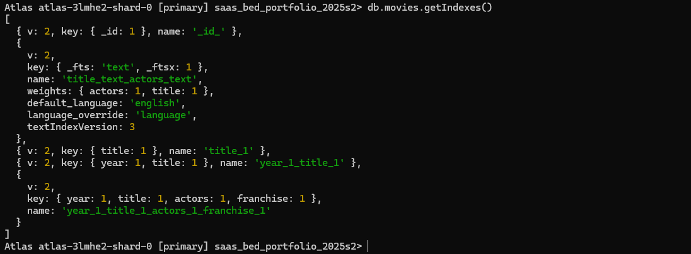

## 9.4 Differences in Indexes

- Briefly explain the differences between an index for sorting against an index for full text searches.

> An index for sorting organises data by specific field values in either ascending or descending order. This speeds up queries, especially when they are modified with .sort(), as much of the work has already been done. For example, finding all the values larger than a certain number is more efficient when they are sorted by that field.
>
> An index for full text searches (a $text index) identifies all of the words in the selected string fields, thus making searches for individual terms or phrases much faster. Using a sorting index on a string field may help with finding the first word, but is of no help with the following words. By isolating each individual word as an index, and sorting that, full text seraches are made much more efficient.

# Step 10: Aggregation

In this step you will be aggregating data within a collection.

## 10.1 Counting documents

- Write an aggregation query to count the number of `Star Wars` movies.

Query Solution:

```js
db.collection_name.find();
```

## 10.2 Mean box office takings…

- Write an aggregation query to calculate the average box office earnings.

Query Solution:

```js
db.collection_name.find();
```

## 10.3 Profit earnings

- Write an aggregation query to calculate the profit (box office – budget) for the movies, showing just the movie title and the profit.

Query Solution:

```js
db.collection_name.find();
```

Screen Shot:


## 10.4 Grouping data

- Write the query to group movies by their franchise and count the number of movies in each franchise.

Query Solution:

```js
db.collection_name.find();
```

# Step 11: Triggers

Using the movies collection, we are now going to create triggers to provide an audit trail for when data is added, updated or deleted.

## 11.1 Create trigger for inserted data

- Create a trigger that monitors the movies collection for new data being added.

Query Solution:

```js
db.collection_name.find();
```

## 11.2 Testing the insert trigger works correctly

- Use the following data to check the trigger functions as expected:

Query Solution:

```js
db.collection_name.find();
```

## 11.3 Create trigger for updated data

- Create a trigger that monitors the movies collection for new data being added.

Query Solution:

```js
db.collection_name.find();
```

Screen Shot:


## 11.4 Testing the update trigger works correctly

- Use the following data to verify that the trigger functions as expected. Make sure that these updates are completed in more than one query:

Query Solution:

```js
db.collection_name.find();
```

## 11.5 Create trigger for deleted data

- Create a trigger that monitors the movies collection for new data being added.

Query Solution:

```js
db.collection_name.find();
```

## 11.6 Testing the delete trigger works correctly

- Use the following conditions to verify that the trigger functions as expected:

Query Solution:

```js
db.collection_name.find();
```

## 11.7 Verify the log contains data…

- Write a query to show the data in the movie audit log.

Query Solution:

```js
db.collection_name.find();
```

Screen Shot:


# Step 12: Submission

What is the URL for your GitHub (or equivalent) repository for this assessment?

```text
add url here
```

# END
